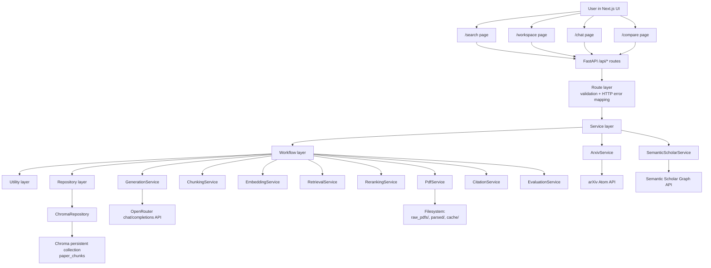

# PaperLens AI Technical Documentation

Last analyzed: 2026-03-29

This file documents the codebase exactly as implemented in the current repository and workspace. Any value not defined in code or config is marked as `[MISSING]` instead of guessed.

Scope of analysis:

- Source-controlled repository files from `git ls-files`
- Live local workspace observations where relevant (`.env`, `backend/data/chroma/chroma.sqlite3`, current test outputs)
- Current working tree code, including uncommitted tracked-file edits already present in `frontend/components/*`

Excluded from the file tree unless explicitly noted:

- `frontend/node_modules/`
- `frontend/.next/`
- `.venv/`
- `backend/.pytest_cache/`
- `__pycache__/`
- Playwright output artifacts generated during this analysis

## 1. System Overview

PaperLens AI is a workflow-first academic paper analysis system that lets a user discover papers, download and parse their PDFs, index them locally into a vector store, and then run grounded downstream workflows over that indexed corpus: research chat, structured multi-paper comparison, and topic synthesis. The backend is a FastAPI application organized into routes, services, workflows, repositories, and utilities; the frontend is a Next.js App Router UI organized around five workflow pages (`/`, `/search`, `/workspace`, `/chat`, `/compare`). The system keeps provenance visible end to end by attaching page numbers, chunk IDs, source URLs, word-boundary offsets, citation labels (`S1`, `S2`, ...), and timing metrics to every retrieval-backed response.

### Core Problem It Solves

The system solves the problem of getting auditable, citation-traceable answers from scientific papers instead of ungrounded chatbot-style responses. It separates the workflow into discovery, ingestion, indexing, retrieval, reranking, generation, and citation resolution so that every answer can be traced back to exact paper chunks and page numbers.

### High-Level Architecture



## 2. Tech Stack & Dependencies

Manifest files found:

- `backend/requirements.txt`
- `frontend/package.json`
- `frontend/package-lock.json`
- `docker-compose.yml`

Manifest files not present:

- `pyproject.toml` `[MISSING]`
- `Dockerfile` `[MISSING]`

### Backend / Python Dependencies

Source: `backend/requirements.txt`

| Category | Package | Exact Version | Used In Code |
| --- | --- | --- | --- |
| Backend framework | `fastapi` | `0.115.0` | Yes |
| ASGI server | `uvicorn[standard]` | `0.30.6` | Used by run commands / Docker Compose, not imported directly |
| Validation / schemas | `pydantic` | `2.9.2` | Yes |
| Settings management | `pydantic-settings` | `2.5.2` | Yes |
| Env loading helper | `python-dotenv` | `1.0.1` | No direct imports found; env file loading is handled through `pydantic-settings` |
| HTTP client | `requests` | `2.32.3` | No direct imports found |
| HTTP client | `httpx` | `0.27.2` | Yes |
| Vector DB | `chromadb` | `1.5.5` | Yes |
| Embeddings / reranking runtime | `sentence-transformers` | `3.1.1` | Yes |
| PDF parsing | `PyMuPDF` | `1.27.2.2` | Yes (`fitz`) |
| Testing | `pytest` | `8.3.3` | Yes |

### Frontend / TypeScript Dependencies

Direct dependency versions resolved from `frontend/package-lock.json`:

| Category | Package | Exact Version | Used In Code |
| --- | --- | --- | --- |
| Frontend framework | `next` | `16.2.1` | Yes |
| UI runtime | `react` | `19.0.0` | Yes |
| UI runtime | `react-dom` | `19.0.0` | Yes |
| Styling helper | `class-variance-authority` | `0.7.1` | Yes |
| Styling helper | `clsx` | `2.1.1` | Yes |
| Icon library | `lucide-react` | `0.462.0` | Yes |
| E2E testing | `@playwright/test` | `1.58.2` | Yes |
| Type defs | `@types/node` | `22.19.15` | TypeScript only |
| Type defs | `@types/react` | `19.2.14` | TypeScript only |
| Type defs | `@types/react-dom` | `19.2.3` | TypeScript only |
| CSS build | `autoprefixer` | `10.4.27` | Build tool only |
| CSS build | `postcss` | `8.5.8` | Build tool only |
| CSS framework | `tailwindcss` | `3.4.19` | Yes |
| Language toolchain | `typescript` | `5.9.3` | Yes |

### Infrastructure / Runtime Versions

| Component | Version / Image | Source |
| --- | --- | --- |
| Python container image | `python:3.11-slim` | `docker-compose.yml` |
| Node container image | `node:20-alpine` | `docker-compose.yml` |
| Backend runtime target | Python `3.11+` | `README.md` |
| Frontend runtime target | Node.js `20+` | `README.md` |

### AI / ML Stack Summary

| Purpose | Component | Exact Value |
| --- | --- | --- |
| Embedding model | `EMBEDDING_MODEL` default | `BAAI/bge-small-en-v1.5` |
| Embedding provider | Local `sentence-transformers` | `3.1.1` runtime |
| Embedding dimension | `[MISSING]` not defined anywhere in repo code/config |
| Reranker model | `RERANKER_MODEL` default | `cross-encoder/ms-marco-MiniLM-L6-v2` |
| Vector DB | Chroma | `chromadb 1.5.5` |
| LLM transport | OpenRouter API | `OPENROUTER_BASE_URL=https://openrouter.ai/api/v1` |
| Configured LLM default | `OPENROUTER_MODEL` | `openrouter/free` |
| Actual model used by structured calls when default config is unchanged | `STRUCTURED_FREE_MODEL_FALLBACK` | `google/gemma-3n-e4b-it:free` |

## 3. RAG Pipeline - Exact Details

### 3.1 Search / Discovery Pipeline

Actual implemented search flow:

1. Frontend `SearchExperience.handleSubmit()` in `frontend/components/search-experience.tsx` calls `searchPapers()` from `frontend/lib/api.ts`.
2. `POST /api/search-papers` is handled by `search_papers()` in `backend/app/api/routes/search_papers.py`.
3. The route injects `SearchService` via `get_search_service()`.
4. `SearchService.search_papers()` in `backend/app/services/search_service.py`:
   - trims `payload.query`
   - rejects blank queries
   - uses an in-memory cache with TTL `300` seconds
   - launches both `ArxivService.search_papers()` and `SemanticScholarService.search_papers()` concurrently
   - returns whichever provider succeeds first
   - cancels the other task once a result is available
5. arXiv parsing is done in `ArxivService._parse_feed()` and `_parse_entry()` in `backend/app/services/arxiv_service.py`.
6. Semantic Scholar normalization is done in `SemanticScholarService.search_papers()` in `backend/app/services/semantic_scholar_service.py`.

Important exact detail:

- The UI markets search as "arXiv", but backend search is not arXiv-only. It concurrently queries both arXiv and Semantic Scholar and returns the first successful provider result.

### 3.2 Document Ingestion Flow

There is no PDF upload endpoint in this repository. `[MISSING: user-upload flow]`

Actual implemented ingestion flow is URL-based:

1. A search result card calls `handleIngestPaper()` in `frontend/components/search-experience.tsx`.
2. The frontend sends the entire paper metadata object to `ingestPaper()` in `frontend/lib/api.ts`.
3. `POST /api/ingest` is handled by `ingest_paper()` in `backend/app/api/routes/ingest.py`.
4. `IngestService.ingest_paper()` in `backend/app/services/ingest_service.py` validates the payload with `IngestRequest.model_validate()`.
5. `IngestWorkflow.ingest_paper()` in `backend/app/workflows/ingest_workflow.py`:
   - calls `settings.ensure_directories()`
   - builds a storage stem with `build_storage_stem(payload.id, payload.title)`
   - computes:
     - `pdf_path = raw_pdfs_dir / f"{paper_stem}.pdf"`
     - `parsed_path = parsed_dir / f"{paper_stem}.json"`
   - if both files already exist and the parsed JSON validates, returns `status="cached"`
   - if the PDF file does not exist, downloads bytes through `PdfService.download_pdf()`
   - parses the PDF into a `ParsedPaperDocument` through `PdfService.parse_pdf()`
   - writes:
     - PDF bytes via `write_bytes_file()`
     - parsed JSON via `write_text_file()`
6. `PdfService.download_pdf()` in `backend/app/services/pdf_service.py`:
   - uses `httpx.AsyncClient`
   - timeout: `30.0` seconds overall, connect timeout capped at `10.0`
   - headers:
     - `Accept: application/pdf`
     - `User-Agent: PaperLens-AI/0.1`
   - validates that the downloaded content is a PDF by checking either:
     - response `content-type` contains `pdf`
     - or bytes start with `%PDF-`
7. `PdfService.parse_pdf()`:
   - opens the file with `fitz.open(str(pdf_path))`
   - extracts per-page text using `page.get_text("text").strip()`
   - builds `ParsedPage(page_number, text)` for each page
   - joins non-empty page text with `\n\n` into `full_text`
   - computes `character_count = len(full_text)` and `word_count = count_words(full_text)`
   - stores `pdf_path` as a repo-relative path using `repo_relative_path()`

### 3.3 Chunking Strategy

Chunking is page-aware and word-based.

Code path:

- `IndexingWorkflow._build_chunks()` -> `ChunkingService.chunk_document()`
- `ChunkingService.chunk_document()` -> `split_text_into_word_windows()`

Exact behavior:

- Input document type: `ParsedPaperDocument`
- Iteration order: pages sorted by `page_number`
- Empty pages: skipped after whitespace normalization
- Normalization: `normalize_whitespace()` collapses all whitespace to single spaces
- Unit of chunking: words (`text.split(" ")`)
- Config defaults from `Settings`:
  - `chunk_size_words = 850`
  - `chunk_overlap_words = 120`
- Derived step size:
  - `step = chunk_size_words - safe_overlap = 850 - 120 = 730`
- Window semantics:
  - `start_word_index` is zero-based and inclusive
  - `end_word_index` is zero-based and exclusive
- Chunk identity:
  - `chunk_index` increments globally across the whole document
  - `page_chunk_index` increments only within the page
- `chunk_id` format from `build_chunk_id()`:
  - `{paper_id}-p{page_number:04d}-c{chunk_index:04d}-{sha256_suffix_12}`
  - Example pattern: `2401.12345-p0002-c0007-a1b2c3d4e5f6`

Chunk metadata stored in each `IndexedChunk`:

- `chunk_id`
- `paper_id`
- `paper_title`
- `page_number`
- `chunk_index`
- `page_chunk_index`
- `source_url`
- `pdf_path`
- `text`
- `word_count`
- `content_hash`
- `start_word_index`
- `end_word_index`

### 3.4 Indexing / Caching Details

Code path:

- `POST /api/index-paper` -> `IndexingService.index_paper()` -> `IndexingWorkflow.index_paper()`

Exact indexing flow:

1. `IndexPaperRequest` validates `paper_id`.
2. Parsed artifact path is resolved by `_resolve_parsed_path()` as:
   - `parsed_dir / f"{build_storage_stem(paper_id)}.json"`
3. Parsed JSON is loaded into `ParsedPaperDocument`.
4. Content hash is computed by `compute_parsed_document_hash()` using a SHA-256 hash over:
   - normalized `paper_id`
   - normalized `title`
   - `source_url`
   - `pdf_url`
   - `page_count`
   - normalized non-empty `pages`
   - normalized `full_text`
5. Index cache file path is:
   - `cache/indexing/{build_storage_stem(paper_id)}.json`
6. If cached record exists and:
   - `cached_record.content_hash == content_hash`
   - and Chroma chunk count for that paper equals `cached_record.chunk_count`
   - and chunk count is greater than `0`
   then the workflow returns `status="cached"` without regenerating embeddings.
7. Otherwise:
   - chunk document
   - embed chunk texts
   - replace all existing chunks for that `paper_id` in Chroma
   - rewrite the index cache record

Index cache schema (`IndexCacheRecord`):

- `paper_id: str`
- `content_hash: str`
- `chunk_count: int`
- `collection_name: str`

### 3.5 Embedding Model

Source:

- `Settings.embedding_model`
- `EmbeddingService` in `backend/app/services/embedding_service.py`

Exact details:

- Model name default: `BAAI/bge-small-en-v1.5`
- Provider: local `SentenceTransformer`
- Batch size: `32`
- `show_progress_bar=False`
- `normalize_embeddings=True`
- Return type: Python `list[list[float]]`
- Embedding dimension: `[MISSING]` not defined in repository code or config

### 3.6 Vector Store

Repository class: `ChromaRepository` in `backend/app/repositories/chroma_repository.py`

Exact details:

- Client type: `chromadb.PersistentClient`
- Path: `settings.chroma_dir`
- Default path from config: `backend/data/chroma`
- Collection name default: `paper_chunks`
- Collection creation metadata: `{"hnsw:space": "cosine"}`
- Distance metric: cosine
- Replace behavior:
  - delete all existing rows where `paper_id == <current paper>`
  - then `upsert()` new chunks and embeddings

Stored Chroma metadata per row (`IndexedChunk.to_chroma_metadata()`):

- `paper_id`
- `paper_title`
- `page_number`
- `chunk_index`
- `page_chunk_index`
- `source_url`
- `pdf_path`
- `word_count`
- `content_hash`
- `start_word_index`
- `end_word_index`

Explicit collection/index tuning beyond `hnsw:space`:

- `[MISSING]` no explicit embedding dimension, HNSW `M`, `efConstruction`, or persistence settings beyond the path and space metric

### 3.7 Retrieval

Primary retrieval class: `RetrievalService` in `backend/app/services/retrieval_service.py`

Query steps:

1. Strip and validate the question.
2. Count indexed chunks first via `ChromaRepository.count_chunks(paper_ids)`.
3. If count is `0`, raise `RetrievalNoIndexedPapersError`.
4. Generate one query embedding through `EmbeddingService.embed_documents([question])`.
5. Query Chroma through `ChromaRepository.query_chunks(query_embedding, limit, paper_ids)`.
6. If no results, raise `RetrievalNoRelevantChunksError`.
7. Convert Chroma documents/metadata/distances into `RetrievedChunk` models.

Similarity score behavior:

- Chroma returns `distances`
- repository computes `similarity_score = 1.0 - distance`
- then clamps to `[-1.0, 1.0]`

Similarity threshold:

- `[MISSING]` no similarity threshold exists in code

Top-k behavior by workflow:

| Workflow | User-facing top-k | Initial retrieval limit | Reranked final context limit |
| --- | --- | --- | --- |
| Chat | default `6`, max `12` | if reranking enabled: `min(12, max(top_k, top_k * 2))`; default `12` | requested `top_k` |
| Compare | fixed per-paper config `compare_top_k_per_paper = 2` | if reranking enabled: `min(12, max(2, 4)) = 4` per paper | `2` per paper |
| Synthesis | fixed config `synthesis_top_k = 6` | if reranking enabled: `min(12, max(6, 12)) = 12` | `6` |

Paper scoping:

- Chat can scope to specific papers via `paper_ids`
- Compare always retrieves separately per paper
- Synthesis may scope to `paper_ids` or search over all indexed papers

### 3.8 Reranking

Class: `RerankingService` in `backend/app/services/reranking_service.py`

Exact details:

- Enabled by default: `reranking_enabled = True`
- Model: `cross-encoder/ms-marco-MiniLM-L6-v2`
- Provider: local `CrossEncoder`
- Input pairs: `(question, chunk.text)`
- Sorting: descending by reranker score
- Failure behavior: caller falls back to original retrieval order

### 3.9 Context Preparation Before Generation

Citation/context assembly is handled by `CitationService` plus prompt utilities.

Exact steps:

1. `CitationService.prepare_context_chunks()`:
   - deduplicates chunks by `(paper_id, normalize_whitespace(text).lower())`
   - drops empty normalized text
   - keeps first `top_k` unique chunks
   - assigns sequential labels `S1`, `S2`, ...
2. `select_context_chunks()` or `_select_balanced_context_chunks()` then enforces char limits.
3. `render_chunk_for_prompt()` renders each chunk in this exact shape:

```text
[S1]
paper_id: <paper_id>
paper_title: <paper_title>
page_number: <page_number>
chunk_id: <chunk_id>
source_url: <source_url>
text: <truncated_text>
```

Prompt context truncation limits:

- `generation_chunk_char_limit = 1800`
- `generation_context_char_limit = 12000`

Compare-specific balancing:

- `_select_balanced_context_chunks()` in `backend/app/workflows/compare_workflow.py`
- round-robins chunks by paper ID
- tries to include at least one chunk from each requested paper even if the global context limit is tight

### 3.10 LLM / Generation Configuration

Generation class: `GenerationService` in `backend/app/services/generation_service.py`

Transport details:

- Endpoint: `POST {OPENROUTER_BASE_URL}/chat/completions`
- Default base URL: `https://openrouter.ai/api/v1`
- Header:
  - `Authorization: Bearer <OPENROUTER_API_KEY>`
  - `Content-Type: application/json`
- Timeout: `OPENROUTER_TIMEOUT_SECONDS`, default `45.0`

Structured generation behavior:

- If `response_model` is set and `OPENROUTER_MODEL != "openrouter/free"`:
  - add `reasoning = {"effort": "none", "exclude": True}`
  - add strict JSON-schema `response_format`
  - add `provider = {"require_parameters": True}`
  - add `plugins = [{"id": "response-healing"}]`
- If `response_model` is set and `OPENROUTER_MODEL == "openrouter/free"`:
  - actual model switches to `google/gemma-3n-e4b-it:free`
  - system messages are collapsed into the first user message
  - no `reasoning`, `provider`, `plugins`, or `response_format` fields are sent

### 3.11 Workflow-Specific Generation Settings

| Workflow | Function | Temperature | Max Tokens | Model Selection |
| --- | --- | --- | --- | --- |
| Chat | `GenerationService.generate_answer()` | `0.1` | `500` | `OPENROUTER_MODEL`, but defaults to `google/gemma-3n-e4b-it:free` because output is structured |
| Compare | `CompareWorkflow.compare_papers()` via `generate_structured_payload()` | `compare_generation_temperature = 0.1` | `900` | same model-selection logic |
| Synthesis | `SynthesisWorkflow.summarize_topic()` via `generate_structured_payload()` | `synthesis_generation_temperature = 0.1` | `900` | same model-selection logic |

### 3.12 Full System Prompts

#### Chat System Prompt

Source: `GenerationService._build_messages()`

```text
You are PaperLens AI, a grounded academic research assistant. Answer only from the retrieved context. Do not use outside knowledge. If the evidence is insufficient, say so directly. Do not invent citations or claim support that is not present. Return strict JSON only, with this shape: {"answer":"...","citations":["S1","S2"],"insufficient_evidence":false}. The citations array must contain only citation labels that appear in the context. Do not include markdown fences or extra commentary.
```

#### Compare System Prompt

Source: `CompareWorkflow._build_messages()`

```text
You are PaperLens AI, a grounded academic comparison assistant. Use only the retrieved evidence provided. Do not use outside knowledge. Do not invent datasets, limitations, strengths, or contributions. If a field is not supported, use the exact string 'Not stated in retrieved evidence.'. Return strict JSON only with this shape: {"summary":"...","comparison_table":[{"paper_id":"...","paper_title":"...","objective":"...","methodology":"...","dataset":"...","strengths":"...","limitations":"...","key_contribution":"..."}],"citations":["S1"],"insufficient_evidence":false}. Include exactly one comparison_table row for each requested paper ID in the same order. Only use citation labels that appear in the retrieved evidence. Do not include markdown fences or extra commentary.
```

#### Synthesis System Prompt

Source: `SynthesisWorkflow._build_messages()`

```text
You are PaperLens AI, a grounded literature synthesis assistant. Use only the retrieved evidence provided. Do not use outside knowledge. Do not invent consensus, open challenges, research gaps, or future directions. If the evidence is uncertain or mixed, say so explicitly in the overview. Return strict JSON only with this shape: {"topic":"...","overview":"...","themes":["..."],"trends":["..."],"open_challenges":["..."],"research_gaps":["..."],"future_directions":["..."],"citations":["S1"],"insufficient_evidence":false}. Use empty arrays when the evidence does not support a category. Only use citation labels that appear in the retrieved evidence. Do not include markdown fences or extra commentary.
```

## 4. API & Backend

### 4.1 FastAPI Application Structure

Entry point: `backend/app/main.py`

- `settings = get_settings()`
- `configure_logging(settings.log_level)`
- `FastAPI(...)` app with:
  - title: `PaperLens AI API`
  - version: `0.1.0`
  - description: `Workflow-first API for grounded paper search, ingest, indexing, chat, comparison, and synthesis.`
- lifespan hook calls `settings.ensure_directories()`
- middleware:
  - `CORSMiddleware`
  - `allow_origins=settings.allowed_origins`
  - `allow_credentials=True`
  - `allow_methods=["*"]`
  - `allow_headers=["*"]`
- API prefix: `/api`

### 4.2 Router Structure

Root router file: `backend/app/api/router.py`

Included routers:

- `health.router` -> prefix `/health`
- `search_papers.router` -> prefix `/search-papers`
- `ingest.router` -> prefix `/ingest`
- `index_paper.router` -> prefix `/index-paper`
- `workspace.router` -> prefix `/workspace`
- `chat.router` -> prefix `/chat`
- `compare.router` -> prefix `/compare`
- `summarize_topic.router` -> prefix `/summarize-topic`

### 4.3 Middleware, Auth, Rate Limiting

| Concern | Status | Exact Detail |
| --- | --- | --- |
| CORS middleware | Present | `fastapi.middleware.cors.CORSMiddleware` |
| Authentication | `[MISSING]` | No auth system exists in repo |
| Authorization | `[MISSING]` | No user/session model exists in repo |
| Rate limiting | `[MISSING]` | No local request throttling middleware exists |
| Request logging middleware | `[MISSING]` | Logging is configured globally, but there is no request middleware |

### 4.4 Endpoint Reference

#### `GET /api/health`

- Route file: `backend/app/api/routes/health.py`
- Route function: `health_check()`
- Service function: `build_health_response()`

Request body:

- none

Response model: `HealthResponse`

| Field | Type | Notes |
| --- | --- | --- |
| `status` | `str` | always `"ok"` in current code |
| `service` | `str` | `settings.app_name` |
| `environment` | `str` | `settings.app_env` |
| `timestamp` | `datetime` | UTC now |

#### `POST /api/search-papers`

- Route file: `backend/app/api/routes/search_papers.py`
- Route function: `search_papers()`
- Service: `SearchService.search_papers()`

Request model: `SearchPapersRequest`

| Field | Type | Constraints |
| --- | --- | --- |
| `query` | `str` | min length `1`, max length `300`; service also trims and rejects blank |
| `max_results` | `int` | default `10`, min `1`, max `25` |

Response model: `SearchPapersResponse`

| Field | Type |
| --- | --- |
| `query` | `str` |
| `count` | `int` |
| `results` | `list[PaperSearchResult]` |

Nested `PaperSearchResult` fields:

- `id: str`
- `title: str`
- `authors: list[str]`
- `abstract: str`
- `published_at: str`
- `updated_at: str`
- `categories: list[str]`
- `pdf_url: str | null`
- `source_url: str`
- `primary_category: str | null`

HTTP error mapping:

- `400` -> `SearchValidationError`
- `502` -> `SearchUpstreamError`

#### `POST /api/ingest`

- Route file: `backend/app/api/routes/ingest.py`
- Route function: `ingest_paper()`
- Service: `IngestService.ingest_paper()`

Route signature detail:

- Route accepts `payload: dict[str, Any]`, then validates inside service with `IngestRequest.model_validate()`

Request model: `IngestRequest`

| Field | Type | Notes |
| --- | --- | --- |
| `id` | `str` | required, trimmed, non-blank |
| `title` | `str` | required, trimmed, non-blank |
| `pdf_url` | `str` | required, must be valid HTTP/HTTPS URL |
| `source_url` | `str` | required, must be valid HTTP/HTTPS URL |
| `authors` | `list[str]` | default `[]` |
| `abstract` | `str | null` | optional |
| `published_at` | `str | null` | optional |
| `updated_at` | `str | null` | optional |
| `categories` | `list[str]` | default `[]` |
| `primary_category` | `str | null` | optional |

Response model: `IngestResponse`

| Field | Type |
| --- | --- |
| `paper_id` | `str` |
| `status` | `"completed" \| "cached"` |
| `pdf_path` | `str` |
| `parsed_path` | `str` |
| `page_count` | `int` |
| `word_count` | `int` |
| `message` | `str` |

HTTP error mapping:

- `400` -> `IngestValidationError`
- `504` -> `IngestTimeoutError`
- `502` -> `IngestUpstreamError`
- `422` -> `IngestProcessingError`
- `500` -> `IngestStorageError`

#### `POST /api/index-paper`

- Route file: `backend/app/api/routes/index_paper.py`
- Route function: `index_paper()`
- Service: `IndexingService.index_paper()`

Route signature detail:

- Route accepts `payload: dict[str, Any]`, then validates inside service with `IndexPaperRequest.model_validate()`

Request model: `IndexPaperRequest`

| Field | Type | Notes |
| --- | --- | --- |
| `paper_id` | `str` | required, trimmed, non-blank |

Response model: `IndexPaperResponse`

| Field | Type |
| --- | --- |
| `paper_id` | `str` |
| `status` | `"completed" \| "cached"` |
| `chunk_count` | `int` |
| `collection_name` | `str` |
| `message` | `str` |

HTTP error mapping:

- `400` -> `IndexingValidationError`
- `404` -> `IndexingNotFoundError`
- `422` -> `IndexingNoContentError`
- `500` -> `IndexingArtifactError`, `IndexingEmbeddingError`, `IndexingStorageError`

#### `GET /api/workspace`

- Route file: `backend/app/api/routes/workspace.py`
- Route function: `get_workspace()`
- Service: `WorkspaceService.get_workspace()`

Request body:

- none

Response model: `WorkspaceResponse`

Top-level fields:

- `summary: WorkspaceSummary`
- `papers: list[WorkspacePaper]`

`WorkspaceSummary` fields:

- `total_paper_count: int`
- `ingested_paper_count: int`
- `indexed_paper_count: int`
- `total_chunk_count: int`

`WorkspacePaper` fields:

- `paper_id: str`
- `title: str`
- `authors: list[str]`
- `categories: list[str]`
- `primary_category: str | null`
- `status: { ingested: bool, indexed: bool }`
- `pdf_path: str | null`
- `parsed_path: str | null`
- `page_count: int`
- `word_count: int`
- `chunk_count: int`
- `source_url: str | null`
- `collection_name: str | null`

HTTP error mapping:

- `500` -> `WorkspaceStateError`

#### `POST /api/chat`

- Route file: `backend/app/api/routes/chat.py`
- Route function: `research_chat()`
- Service: `ChatService.answer_question()`
- Workflow: `ChatWorkflow.answer_question()`

Request model: `ChatRequest`

| Field | Type | Notes |
| --- | --- | --- |
| `question` | `str` | required, trimmed, max length `2000` |
| `paper_ids` | `list[str]` | optional, deduplicated and trimmed |
| `top_k` | `int | null` | optional; validated by service against `1..retrieval_top_k_max` |

Response model: `ChatResponse`

| Field | Type |
| --- | --- |
| `status` | `"completed" \| "partial"` |
| `question` | `str` |
| `answer` | `str | null` |
| `citations` | `list[ChatCitation]` |
| `retrieved_chunks` | `list[RetrievedChunk]` |
| `meta` | `WorkflowMeta | null` |
| `message` | `str` |

Nested `ChatCitation` fields:

- `label`
- `paper_id`
- `paper_title`
- `page_number`
- `chunk_id`
- `source_url`

Nested `RetrievedChunk` fields:

- `label: str | null`
- `chunk_id`
- `paper_id`
- `paper_title`
- `page_number`
- `chunk_index`
- `page_chunk_index`
- `source_url`
- `pdf_path`
- `text`
- `word_count`
- `start_word_index`
- `end_word_index`
- `similarity_score: float | null`

Nested `WorkflowMeta` fields:

- `retrieval_ms`
- `reranking_ms`
- `generation_ms`
- `total_ms`
- `retrieved_chunk_count`
- `citation_count`
- `status: "completed" | "partial" | "failed"`

HTTP error mapping:

- `400` -> `ChatValidationError`
- `404` -> `ChatNotReadyError`
- `422` -> `ChatEvidenceError`
- `500` -> `ChatServiceError`

#### `POST /api/compare`

- Route file: `backend/app/api/routes/compare.py`
- Route function: `compare_papers()`
- Service: `CompareService.compare_papers()`
- Workflow: `CompareWorkflow.compare_papers()`

Request model: `CompareRequest`

| Field | Type | Notes |
| --- | --- | --- |
| `paper_ids` | `list[str]` | required; must contain `2..5` unique trimmed IDs |
| `question` | `str | null` | optional; max length `2000`; defaults to `DEFAULT_COMPARE_QUESTION` |

Resolved default question:

```text
Compare these papers in terms of objective, methodology, dataset usage, strengths, limitations, and key contribution.
```

Response model: `CompareResponse`

| Field | Type |
| --- | --- |
| `status` | `"completed" \| "partial"` |
| `summary` | `str | null` |
| `comparison_table` | `list[ComparisonRow]` |
| `citations` | `list[ChatCitation]` |
| `retrieved_chunks` | `list[RetrievedChunk]` |
| `meta` | `WorkflowMeta | null` |
| `message` | `str` |

`ComparisonRow` fields:

- `paper_id`
- `paper_title`
- `objective`
- `methodology`
- `dataset`
- `strengths`
- `limitations`
- `key_contribution`

Default missing-value string:

```text
Not stated in retrieved evidence.
```

HTTP error mapping:

- `400` -> `CompareValidationError`
- `404` -> `CompareNotReadyError`
- `422` -> `CompareEvidenceError`
- `500` -> `CompareServiceError`

#### `POST /api/summarize-topic`

- Route file: `backend/app/api/routes/summarize_topic.py`
- Route function: `summarize_topic()`
- Service: `SynthesisService.summarize_topic()`
- Workflow: `SynthesisWorkflow.summarize_topic()`

Request model: `TopicSynthesisRequest`

| Field | Type | Notes |
| --- | --- | --- |
| `topic` | `str | null` | optional; max length `500` |
| `paper_ids` | `list[str]` | optional |

Validation rule:

- request must include a non-blank `topic`, at least one `paper_id`, or both

Derived properties:

- `display_topic`: `topic` or `"Selected indexed papers"`
- `retrieval_query`:
  - if `topic` present:
    - `"{topic}. Focus on recurring themes, methodological trends, open challenges, research gaps, and future directions."`
  - else:
    - `"Synthesize the selected papers with attention to recurring themes, methodology trends, open challenges, research gaps, and future directions."`

Response model: `TopicSynthesisResponse`

| Field | Type |
| --- | --- |
| `status` | `"completed" \| "partial"` |
| `topic` | `str` |
| `overview` | `str | null` |
| `themes` | `list[str]` |
| `trends` | `list[str]` |
| `open_challenges` | `list[str]` |
| `research_gaps` | `list[str]` |
| `future_directions` | `list[str]` |
| `citations` | `list[ChatCitation]` |
| `retrieved_chunks` | `list[RetrievedChunk]` |
| `meta` | `WorkflowMeta | null` |
| `message` | `str` |

HTTP error mapping:

- `400` -> `SynthesisValidationError`
- `404` -> `SynthesisNotReadyError`
- `422` -> `SynthesisEvidenceError`
- `500` -> `SynthesisServiceError`

## 5. Frontend / UI

### 5.1 Frontend Tech

- Framework: Next.js App Router (`frontend/app/*`)
- Runtime: React 19
- Language: TypeScript strict mode
- Styling: Tailwind CSS plus CSS custom properties in `frontend/app/globals.css`
- Icons: `lucide-react`
- Responsive layout:
  - shared `AppShell`
  - left sidebar navigation
  - responsive cards/table layouts
- Testing:
  - Playwright smoke tests with mocked API routes

### 5.2 Frontend Pages / Screens

| Route | File | Main Component(s) | Purpose |
| --- | --- | --- | --- |
| `/` | `frontend/app/page.tsx` | `HeroPanel`, `SectionCard`, `WorkflowCard`, `StatusChip` | Dashboard / landing overview of the workflow |
| `/search` | `frontend/app/search/page.tsx` | `SearchExperience` | Search papers, then ingest and index from result cards |
| `/workspace` | `frontend/app/workspace/page.tsx` | `WorkspaceExperience` | Inspect corpus state from parsed JSON, index cache, and Chroma metadata |
| `/chat` | `frontend/app/chat/page.tsx` | `ChatExperience` | Ask grounded questions over indexed papers |
| `/compare` | `frontend/app/compare/page.tsx` | `CompareExperience`, `TopicSynthesisExperience` | Run structured paper comparison and topic synthesis |

Observed production build output (`npm run build` on 2026-03-29):

- `/`
- `/chat`
- `/compare`
- `/search`
- `/workspace`

All were statically prerendered in the build output.

### 5.3 Key Layout Components

#### `AppShell`

File: `frontend/components/app-shell.tsx`

- wraps every page
- renders:
  - `Sidebar`
  - `TopBar`
  - page `<main>` content area

#### `Sidebar`

File: `frontend/components/sidebar.tsx`

- client component
- uses `usePathname()` to highlight the active route
- reads nav definitions from `frontend/lib/navigation.ts`
- renders five navigation entries:
  - Dashboard
  - Search Papers
  - Paper Workspace
  - Research Chat
  - Compare Papers

#### `TopBar`

File: `frontend/components/top-bar.tsx`

- shows page title "Research workflow dashboard"
- renders a formatted date pill and "Local-first pipeline" status chip
- exact date source: `new Date()` formatted with `Intl.DateTimeFormat("en-US", ...)`

### 5.4 Search UI

Main orchestration component: `frontend/components/search-experience.tsx`

State held in component:

- `query`
- `maxResults`
- `results`
- `activeQuery`
- `pendingQuery`
- `inputError`
- `searchError`
- `hasSearched`
- `isLoading`
- `ingestStates`
- `indexStates`

Key child components:

- `SearchBar`
- `SearchResults`
- `PaperCard`
- `IngestButton`
- `IndexButton`

Behavior:

- submits search to `/api/search-papers`
- each paper card can:
  - ingest via `/api/ingest`
  - then index via `/api/index-paper`
- keeps per-paper ingest and index mutation state in local React state

### 5.5 Workspace UI

Main component: `frontend/components/workspace-experience.tsx`

Behavior:

- client component using `useEffect()` to load workspace on mount
- calls `fetchWorkspace()` with `cache: "no-store"`
- uses `startTransition()` when applying a refreshed workspace snapshot
- supports:
  - manual refresh
  - indexing directly from workspace rows
  - copying all indexed paper IDs to clipboard

Data shown:

- workspace summary cards:
  - tracked papers
  - ingested
  - indexed
  - corpus chunks
- per-paper rows:
  - title
  - categories
  - ingestion/index status
  - pages
  - words
  - chunks
  - collection name
  - source link
  - index/refresh action

### 5.6 Chat UI

Main component: `frontend/components/chat-experience.tsx`

Key child components:

- `ChatInput`
- `ChatMessage`
- `MetaMetricsCard`
- `CitationList`
- `RetrievedChunkCard`

Behavior:

- parses comma-separated paper IDs with `parsePaperIds()`
- sends `question`, optional `paper_ids`, and `top_k`
- default `top_k = 6`
- displays:
  - answer panel
  - workflow metrics
  - citation list
  - evidence panel with raw retrieved chunks

### 5.7 Compare UI

Main component: `frontend/components/compare-experience.tsx`

Behavior:

- requires `2..5` paper IDs
- default question text:

```text
Compare these papers in terms of methodology, datasets, strengths, and limitations.
```

- renders:
  - summary block
  - `MetaMetricsCard`
  - `ComparisonTable`
  - `CitationList`
  - evidence panel

Responsive detail:

- `ComparisonTable` uses stacked cards below `2xl`
- `ComparisonTable` uses a `<table>` above `2xl`

### 5.8 Topic Synthesis UI

Main component: `frontend/components/topic-synthesis-experience.tsx`

Behavior:

- accepts:
  - optional free-text topic
  - optional paper IDs
- requires at least one of the two
- renders:
  - overview
  - themes
  - trends
  - open challenges
  - research gaps
  - future directions
  - citations
  - evidence panel

### 5.9 Shared Presentation Components

| Component | File | Exact Role |
| --- | --- | --- |
| `SectionCard` | `frontend/components/section-card.tsx` | Standard page/card shell with eyebrow, title, description, body |
| `StatusChip` | `frontend/components/status-chip.tsx` | Tone-variant pill (`neutral`, `positive`, `warning`) built with `cva` |
| `MetaMetricsCard` | `frontend/components/meta-metrics-card.tsx` | Shows `retrieval_ms`, `reranking_ms`, `generation_ms`, `total_ms`, chunk count, citation count |
| `CitationList` | `frontend/components/citation-list.tsx` | Renders clickable citations linking to `source_url` |
| `RetrievedChunkCard` | `frontend/components/retrieved-chunk-card.tsx` | Shows label, paper ID, page number, chunk text, similarity score, PDF path |
| `PaperIdInput` | `frontend/components/paper-id-input.tsx` | Parses/removes/copies comma-separated paper IDs |
| `EmptyState` | `frontend/components/ui/empty-state.tsx` | Generic empty state |
| `ErrorState` | `frontend/components/ui/error-state.tsx` | Generic error state |
| `LoadingState` | `frontend/components/ui/loading-state.tsx` | Generic loading state |

## 6. Data Flow

### 6.1 Important Correction

The repository does not implement a "user uploads PDF" flow. `[MISSING]`

Implemented flow:

- user searches topic
- selects a result
- backend downloads the PDF from `pdf_url`
- backend parses, chunks, embeds, and stores it
- later workflows retrieve over the indexed chunks

### 6.2 End-to-End Flow: Search -> Ingest -> Index -> Answer

#### A. Search

1. User enters a query in `SearchBar` (`frontend/components/search-bar.tsx`).
2. `SearchExperience.handleSubmit()` sends `POST /api/search-papers`.
3. `backend/app/api/routes/search_papers.py::search_papers()` calls `SearchService.search_papers()`.
4. `SearchService._search_with_fallback()` launches:
   - `ArxivService.search_papers()`
   - `SemanticScholarService.search_papers()`
5. First successful provider returns normalized `PaperSearchResult[]`.
6. Frontend stores them in `results` and renders `PaperCard` entries.

#### B. Ingest

1. User clicks `IngestButton` inside `PaperCard`.
2. `SearchExperience.handleIngestPaper()` calls `frontend/lib/api.ts::ingestPaper()`.
3. `POST /api/ingest` reaches `IngestService.ingest_paper()`.
4. `IngestService._validate_request()` validates `IngestRequest`.
5. `IngestWorkflow.ingest_paper()`:
   - computes `pdf_path` and `parsed_path`
   - uses cached files if both exist and parsed JSON is valid
   - otherwise downloads the PDF
   - parses page text with PyMuPDF
   - writes parsed JSON
6. Frontend updates `ingestStates[paper.id]` with:
   - `status`
   - `message`
   - `pageCount`
   - `wordCount`

#### C. Index

1. User clicks `IndexButton`.
2. `SearchExperience.handleIndexPaper()` sends `POST /api/index-paper`.
3. `IndexingService.index_paper()` validates `IndexPaperRequest`.
4. `IndexingWorkflow.index_paper()`:
   - loads parsed JSON
   - computes `content_hash`
   - checks `cache/indexing/<paper_id>.json`
   - if cache and stored Chroma count match, returns `status="cached"`
   - else chunks the document with `ChunkingService`
   - embeds chunk texts with `EmbeddingService`
   - writes to Chroma through `ChromaRepository.replace_paper_chunks()`
   - rewrites the cache record
5. Frontend updates `indexStates[paper.id]`.

#### D. Chat Answer

1. User goes to `/chat`.
2. `ChatInput` submits `question`, optional `paper_ids`, `top_k`.
3. `frontend/lib/api.ts::researchChat()` calls `POST /api/chat`.
4. `ChatService.answer_question()`:
   - validates `ChatRequest`
   - clamps `top_k` to the configured allowed range
5. `ChatWorkflow.answer_question()`:
   - starts `EvaluationTracker`
   - computes `retrieval_limit`
   - retrieves chunks with `RetrievalService.retrieve_chunks()`
   - optionally reranks with `RerankingService.rerank_chunks()`
   - deduplicates and labels context with `CitationService.prepare_context_chunks()`
   - truncates prompt context with `select_context_chunks()`
   - calls `GenerationService.generate_answer()`
   - resolves model-returned citation labels with `CitationService.resolve_citations()`
   - appends a human-readable `Sources:` section with `compose_answer()`
   - finalizes `WorkflowMeta`
6. Frontend renders:
   - `ChatMessage`
   - `MetaMetricsCard`
   - `CitationList`
   - evidence panel of `RetrievedChunkCard[]`

### 6.3 End-to-End Flow: Compare

1. User goes to `/compare`.
2. `CompareExperience.handleSubmit()` validates `2..5` paper IDs.
3. `frontend/lib/api.ts::comparePapers()` sends `POST /api/compare`.
4. `CompareService.compare_papers()` validates `CompareRequest`.
5. `CompareWorkflow.compare_papers()`:
   - checks every paper is indexed via `ChromaRepository.count_chunks_for_paper()`
   - builds retrieval query:

```text
<question>

Focus on objective, methodology, dataset usage, strengths, limitations, and key contribution.
```

   - retrieves chunks separately per paper
   - optionally reranks per paper
   - merges per-paper chunks
   - deduplicates/labeled them
   - balances context so papers are represented fairly
   - calls `GenerationService.generate_structured_payload()`
   - normalizes rows back to requested paper order
6. Frontend renders:
   - narrative summary
   - comparison table/cards
   - citations
   - retrieved evidence

### 6.4 End-to-End Flow: Topic Synthesis

1. User stays on `/compare` and uses `TopicSynthesisExperience`.
2. `frontend/lib/api.ts::summarizeTopic()` sends `POST /api/summarize-topic`.
3. `SynthesisService.summarize_topic()` validates `TopicSynthesisRequest`.
4. `SynthesisWorkflow.summarize_topic()`:
   - optionally checks indexed status of `paper_ids`
   - derives `payload.retrieval_query`
   - retrieves chunks across all selected or all indexed papers
   - reranks to `synthesis_top_k`
   - prepares labeled context
   - calls `GenerationService.generate_structured_payload()`
   - resolves citations and returns `TopicSynthesisResponse`
5. Frontend renders:
   - overview
   - structured list panels
   - citations
   - evidence panel

## 7. Docker & Deployment

### 7.1 Docker Compose Services

Source: `docker-compose.yml`

#### `backend`

- Image: `python:3.11-slim`
- Working directory: `/app`
- Command:

```sh
sh -c "pip install --no-cache-dir -r requirements.txt && uvicorn app.main:app --host 0.0.0.0 --port 8000 --reload"
```

- Environment:
  - `PYTHONDONTWRITEBYTECODE=1`
  - `PYTHONUNBUFFERED=1`
- `env_file`:
  - `.env`
- Volume mount:
  - `./backend:/app`
- Port mapping:
  - `8000:8000`

Role:

- serves the FastAPI API
- installs Python dependencies at container startup
- stores runtime data inside the bind-mounted backend directory

#### `frontend`

- Image: `node:20-alpine`
- Working directory: `/app`
- Command:

```sh
sh -c "npm install && npm run dev"
```

- Depends on:
  - `backend`
- Environment:
  - `NEXT_TELEMETRY_DISABLED=1`
  - `WATCHPACK_POLLING=true`
- `env_file`:
  - `.env`
- Volume mounts:
  - `./frontend:/app`
  - `frontend_node_modules:/app/node_modules`
- Port mapping:
  - `3000:3000`

Role:

- runs the Next.js development server
- installs JS dependencies at container startup

#### Named volumes

- `frontend_node_modules`

### 7.2 Environment Variables

#### Variables defined in `.env.example`

| Variable | Default | Used By |
| --- | --- | --- |
| `APP_ENV` | `development` | backend settings |
| `LOG_LEVEL` | `INFO` | backend logging |
| `ALLOWED_ORIGINS` | `http://localhost:3000` | CORS |
| `NEXT_PUBLIC_API_BASE_URL` | `http://localhost:8000` | frontend API base |
| `ARXIV_BASE_URL` | `https://export.arxiv.org/api/query` | `ArxivService` |
| `OPENROUTER_API_KEY` | empty | `GenerationService` |
| `OPENROUTER_BASE_URL` | `https://openrouter.ai/api/v1` | `GenerationService` |
| `OPENROUTER_MODEL` | `openrouter/free` | `GenerationService` |
| `OPENROUTER_TIMEOUT_SECONDS` | `45` | `GenerationService` |
| `EMBEDDING_MODEL` | `BAAI/bge-small-en-v1.5` | `EmbeddingService` |
| `RETRIEVAL_TOP_K_DEFAULT` | `6` | chat default |
| `RETRIEVAL_TOP_K_MAX` | `12` | global retrieval cap |
| `RERANKING_ENABLED` | `true` | reranker toggle |
| `RERANKER_MODEL` | `cross-encoder/ms-marco-MiniLM-L6-v2` | `RerankingService` |
| `DATA_DIR` | `backend/data` | backend storage root |
| `CHROMA_DIR` | `backend/data/chroma` | Chroma path |

#### Backend settings that exist only in code defaults

| Variable / Setting | Default | Defined In |
| --- | --- | --- |
| `app_name` | `PaperLens AI API` | `Settings` |
| `api_prefix` | `/api` | `Settings` |
| `compare_top_k_per_paper` | `2` | `Settings` |
| `synthesis_top_k` | `6` | `Settings` |
| `compare_max_papers` | `5` | `Settings` |
| `enable_metrics_collection` | `True` | `Settings` |
| `compare_generation_temperature` | `0.1` | `Settings` |
| `synthesis_generation_temperature` | `0.1` | `Settings` |
| `chunk_size_words` | `850` | `Settings` |
| `chunk_overlap_words` | `120` | `Settings` |
| `chroma_collection_name` | `paper_chunks` | `Settings` |
| `generation_chunk_char_limit` | `1800` | `Settings` |
| `generation_context_char_limit` | `12000` | `Settings` |

### 7.3 Local Run Commands

#### Backend

```bash
python -m venv .venv
.venv\Scripts\activate
pip install -r backend/requirements.txt
cd backend
python -m uvicorn app.main:app --reload
```

#### Frontend

```bash
cd frontend
npm install
npm run dev
```

#### Combined

```bash
docker compose up --build
```

### 7.4 Missing Deployment Assets

- `Dockerfile` `[MISSING]`
- Kubernetes manifests `[MISSING]`
- reverse proxy config `[MISSING]`
- healthchecks in `docker-compose.yml` `[MISSING]`

## 8. Performance & Results

### 8.1 Built-In Metrics

Metrics are generated by `EvaluationService` / `EvaluationTracker` in `backend/app/services/evaluation_service.py`.

Each workflow can return:

- `retrieval_ms`
- `reranking_ms`
- `generation_ms`
- `total_ms`
- `retrieved_chunk_count`
- `citation_count`
- `status`

Tracked workflows:

- `chat`
- `compare`
- `synthesis`

Metrics collection toggle:

- `enable_metrics_collection = True` by default

### 8.2 Accuracy / Quality Benchmarks

Formal benchmark artifacts committed in repo:

- `[MISSING]` no offline retrieval benchmark dataset
- `[MISSING]` no accuracy, precision, recall, MRR, nDCG, BLEU, ROUGE, or hallucination score outputs
- `[MISSING]` no latency benchmark report files

What exists instead:

- runtime latency metrics returned in API responses
- unit/integration tests asserting behavior and fallback handling

### 8.3 Test Suites Present

Backend test files:

- `backend/tests/test_api_routes.py` - route validation, success shapes, and HTTP error mapping
- `backend/tests/test_arxiv_service.py` - redirect handling and error logging diagnostics
- `backend/tests/test_chat_workflow.py` - grounded chat success/fallback behavior
- `backend/tests/test_chunking_service.py` - page-aware chunking semantics and deterministic chunk IDs
- `backend/tests/test_compare_workflow.py` - compare workflow success/fallback/indexed-paper checks
- `backend/tests/test_config.py` - config parsing and repo-relative path resolution tests
- `backend/tests/test_evaluation_service.py` - stage timing collection and disable flag
- `backend/tests/test_generation_service.py` - OpenRouter request payload construction and malformed response handling
- `backend/tests/test_health.py` - health endpoint
- `backend/tests/test_index_paper.py` - indexing pipeline, caching, deterministic IDs, and reindex behavior
- `backend/tests/test_ingest_paper.py` - ingest pipeline, PDF parsing, caching, and invalid URL handling
- `backend/tests/test_retrieval_service.py` - retrieval flow, scoping, and error wrapping
- `backend/tests/test_search_papers.py` - search normalization and upstream fallback errors
- `backend/tests/test_synthesis_workflow.py` - topic synthesis success/fallback behavior
- `backend/tests/test_workspace.py` - workspace aggregation behavior

Frontend smoke test files:

- `frontend/tests/e2e/mock-api.ts` - mocked API payloads and route interception
- `frontend/tests/e2e/smoke.spec.ts` - dashboard/search/ingest/index/chat/compare/synthesis smoke flow

### 8.4 Observed Validation Results During This Analysis

Commands run on 2026-03-29:

| Command | Result | Exact Observation |
| --- | --- | --- |
| `python scripts/run_all_tests.py` | Failed | Repo-level test wrapper chose a broken local virtualenv and exited with `failed to locate pyvenv.cfg` before backend tests started |
| `cmd /c npm run typecheck` | Passed | TypeScript check completed with exit code `0` |
| `cmd /c npm run build` | Passed | Next.js 16.2.1 production build completed and prerendered 5 app routes plus `_not-found` |
| `cmd /c npm run smoke` | Failed | 1 passed / 1 failed; failure expected `getByRole("cell", { name: "EyePACS" })` |
| `python -m pytest -q` in `backend/` | Failed to start | system Python lacked backend deps (`ModuleNotFoundError: No module named 'fastapi'`) |

### 8.5 Current Test Issue Observed

The Playwright smoke failure is consistent with the current responsive UI code:

- `ComparisonTable` only renders an actual HTML `<table>` at the `2xl` breakpoint.
- At smaller widths it renders stacked card sections instead of table cells.
- The failing smoke assertion expects `role="cell"` content (`EyePACS`) at default Playwright desktop width.

Implication:

- The smoke test currently assumes the desktop-table layout, but the default viewport during the run was below the `2xl` breakpoint required by `ComparisonTable`.

## 9. Project Structure

Source-controlled tree below comes from `git ls-files`.

```text
paperlens_ai/
|-- .env.example - Example environment file defining backend and frontend runtime variables.
|-- .gitignore - Ignore rules for Python, Node, env files, caches, and generated data.
|-- README.md - Project overview, setup guide, workflow explanation, and test instructions.
|-- docker-compose.yml - Two-service local development stack for backend and frontend.
|-- backend/
|   |-- requirements.txt - Pinned Python dependencies for the backend.
|   |-- app/
|   |   |-- __init__.py - Backend package marker.
|   |   |-- main.py - FastAPI application entrypoint, CORS setup, and lifespan directory bootstrap.
|   |   |-- api/
|   |   |   |-- __init__.py - API package marker.
|   |   |   |-- router.py - Aggregates all route modules under the shared API router.
|   |   |   `-- routes/
|   |   |       |-- __init__.py - Routes package marker.
|   |   |       |-- chat.py - `/api/chat` route and chat-service error mapping.
|   |   |       |-- compare.py - `/api/compare` route and compare-service error mapping.
|   |   |       |-- health.py - `/api/health` route.
|   |   |       |-- index_paper.py - `/api/index-paper` route and indexing-service error mapping.
|   |   |       |-- ingest.py - `/api/ingest` route and ingest-service error mapping.
|   |   |       |-- search_papers.py - `/api/search-papers` route and search-service error mapping.
|   |   |       |-- summarize_topic.py - `/api/summarize-topic` route and synthesis-service error mapping.
|   |   |       `-- workspace.py - `/api/workspace` route and workspace-service error mapping.
|   |   |-- core/
|   |   |   |-- __init__.py - Core package marker.
|   |   |   |-- config.py - Pydantic settings model, defaults, validators, and directory resolution logic.
|   |   |   `-- logging.py - Global logging configuration helper.
|   |   |-- repositories/
|   |   |   |-- __init__.py - Repositories package marker.
|   |   |   `-- chroma_repository.py - Persistent Chroma access layer for writing, querying, and inspecting indexed chunks.
|   |   |-- schemas/
|   |   |   |-- __init__.py - Schema package marker.
|   |   |   |-- chat.py - Pydantic models for chat requests, citations, chunks, and workflow metadata.
|   |   |   |-- compare.py - Pydantic models for compare requests, comparison rows, and compare responses.
|   |   |   |-- health.py - Pydantic model for health responses.
|   |   |   |-- indexing.py - Pydantic models for indexing requests, indexed chunks, and cache records.
|   |   |   |-- ingest.py - Pydantic models for ingest requests, parsed pages, parsed documents, and ingest responses.
|   |   |   |-- search.py - Pydantic models for paper-search requests and normalized search results.
|   |   |   |-- synthesis.py - Pydantic models for topic-synthesis requests and responses.
|   |   |   `-- workspace.py - Pydantic models for workspace summaries and paper-state rows.
|   |   |-- services/
|   |   |   |-- __init__.py - Services package marker.
|   |   |   |-- arxiv_service.py - Async arXiv Atom client, retry logic, XML parsing, and result normalization.
|   |   |   |-- chat_service.py - Chat payload validation and chat-workflow invocation.
|   |   |   |-- chunking_service.py - Page-aware word-window chunk generation.
|   |   |   |-- citation_service.py - Chunk deduplication, citation labeling, citation resolution, and answer composition.
|   |   |   |-- compare_service.py - Compare payload validation and compare-workflow invocation.
|   |   |   |-- embedding_service.py - Local sentence-transformer embedding generation.
|   |   |   |-- evaluation_service.py - Latency and evidence-count tracking for workflows.
|   |   |   |-- generation_service.py - OpenRouter request building, structured JSON parsing, and answer generation.
|   |   |   |-- health_service.py - Backend health response factory.
|   |   |   |-- indexing_service.py - Index payload validation and indexing-workflow invocation.
|   |   |   |-- ingest_service.py - Ingest payload validation and ingest-workflow invocation.
|   |   |   |-- pdf_service.py - PDF download validation and page-level text extraction with PyMuPDF.
|   |   |   |-- reranking_service.py - Local cross-encoder reranking of retrieved chunks.
|   |   |   |-- retrieval_service.py - Query embedding generation and Chroma chunk retrieval.
|   |   |   |-- search_service.py - Search orchestration, provider fallback, and in-memory query caching.
|   |   |   |-- semantic_scholar_service.py - Semantic Scholar search fallback client and normalization logic.
|   |   |   |-- synthesis_service.py - Topic-synthesis payload validation and synthesis-workflow invocation.
|   |   |   `-- workspace_service.py - Local artifact + Chroma aggregation for corpus/workspace state.
|   |   |-- utils/
|   |   |   |-- __init__.py - Utilities package marker.
|   |   |   |-- chunk_utils.py - Whitespace normalization and sliding word-window logic.
|   |   |   |-- file_utils.py - Safe storage-stem building, repo-relative path conversion, and file writers.
|   |   |   |-- hash_utils.py - Parsed-document hashing and deterministic chunk ID generation.
|   |   |   |-- prompt_utils.py - Prompt truncation, context selection, and prompt chunk rendering helpers.
|   |   |   `-- text_utils.py - Word-count helper.
|   |   `-- workflows/
|   |       |-- __init__.py - Workflows package marker.
|   |       |-- chat_workflow.py - Retrieve-rerank-generate-cite orchestration for grounded chat.
|   |       |-- compare_workflow.py - Per-paper retrieval and structured comparison orchestration.
|   |       |-- indexing_workflow.py - Parsed-artifact loading, chunking, embedding, Chroma writing, and index caching.
|   |       |-- ingest_workflow.py - PDF download/parse persistence orchestration.
|   |       `-- synthesis_workflow.py - Topic retrieval, reranking, synthesis generation, and citation orchestration.
|   |-- data/
|   |   |-- cache/.gitkeep - Keeps the cache directory in Git.
|   |   |-- chroma/.gitkeep - Keeps the Chroma persistence directory in Git.
|   |   |-- parsed/.gitkeep - Keeps the parsed-artifact directory in Git.
|   |   `-- raw_pdfs/.gitkeep - Keeps the raw-PDF storage directory in Git.
|   `-- tests/
|       |-- conftest.py - Shared pytest fixtures for FastAPI dependency override cleanup and TestClient creation.
|       |-- test_api_routes.py - Route-level validation, error mapping, and success-shape tests across main endpoints.
|       |-- test_arxiv_service.py - Redirect-following and arXiv error-logging tests.
|       |-- test_chat_workflow.py - Chat workflow grounding, reranker fallback, and route response-shape tests.
|       |-- test_chunking_service.py - Chunk window semantics and deterministic chunk ID tests.
|       |-- test_compare_workflow.py - Compare workflow success, fallback, and not-ready/evidence-error tests.
|       |-- test_config.py - Settings parsing and repo-relative path resolution tests.
|       |-- test_evaluation_service.py - Workflow metric collection tests.
|       |-- test_generation_service.py - Structured generation payload construction and malformed-response tests.
|       |-- test_health.py - Health endpoint test.
|       |-- test_index_paper.py - Indexing success, caching, reindexing, and deterministic-ID tests.
|       |-- test_ingest_paper.py - Ingest success, validation, upstream failure, and caching tests.
|       |-- test_retrieval_service.py - Retrieval scoping, success, and infrastructure-error tests.
|       |-- test_search_papers.py - Search normalization, blank-query rejection, and upstream fallback tests.
|       |-- test_synthesis_workflow.py - Topic synthesis success, fallback, and validation tests.
|       `-- test_workspace.py - Workspace aggregation and failure-path tests.
|-- docs/
|   |-- demo_script.md - Demo walkthrough for presenting the full workflow.
|   |-- report_outline.md - Suggested coursework/report structure for describing the project.
|   |-- technical_documentation.md - This file.
|   `-- testing.md - Testing guide for backend, frontend, smoke, and full-runner usage.
|-- frontend/
|   |-- next-env.d.ts - Next.js TypeScript ambient declarations.
|   |-- next.config.ts - Minimal Next.js config enabling `reactStrictMode`.
|   |-- package-lock.json - Resolved frontend dependency lockfile.
|   |-- package.json - Frontend package manifest and scripts.
|   |-- playwright.config.ts - Playwright config, base URL, and web server startup settings.
|   |-- postcss.config.js - PostCSS plugin configuration for Tailwind and Autoprefixer.
|   |-- tailwind.config.ts - Tailwind content globs and theme extension.
|   |-- tsconfig.json - TypeScript compiler configuration for the frontend.
|   |-- app/
|   |   |-- globals.css - Global Tailwind directives and app-wide CSS variables/theme.
|   |   |-- layout.tsx - Root layout, metadata, font loading, and app-shell wrapping.
|   |   |-- page.tsx - Dashboard / landing page.
|   |   |-- chat/page.tsx - Chat page shell and explanatory header content.
|   |   |-- compare/page.tsx - Compare/synthesis page shell and explanatory header content.
|   |   |-- search/page.tsx - Search page shell and explanatory header content.
|   |   `-- workspace/page.tsx - Workspace page entrypoint.
|   |-- components/
|   |   |-- app-shell.tsx - Shared layout wrapper with sidebar, top bar, and main content region.
|   |   |-- chat-experience.tsx - Client-side grounded chat workflow UI orchestration.
|   |   |-- chat-input.tsx - Chat question form with optional paper-ID scoping and top-k selector.
|   |   |-- chat-message.tsx - Answer/partial-result presentation component.
|   |   |-- citation-list.tsx - Clickable citation card list.
|   |   |-- compare-experience.tsx - Client-side compare workflow orchestration.
|   |   |-- comparison-table.tsx - Responsive compare-results renderer (cards on small screens, table on 2xl).
|   |   |-- hero-panel.tsx - Dashboard hero section.
|   |   |-- index-button.tsx - Index action button with mutation-state rendering.
|   |   |-- ingest-button.tsx - Ingest action button with mutation-state rendering.
|   |   |-- meta-metrics-card.tsx - UI renderer for workflow metric payloads.
|   |   |-- paper-card.tsx - Search result card with metadata, status, and ingest/index actions.
|   |   |-- paper-id-input.tsx - Comma-separated paper-ID input with chip parsing and copy helper.
|   |   |-- retrieved-chunk-card.tsx - Retrieved evidence card showing raw chunk text and provenance.
|   |   |-- search-bar.tsx - Search query form and max-results selector.
|   |   |-- search-experience.tsx - Client-side paper search + ingest + index workflow orchestration.
|   |   |-- search-results.tsx - Search-result list renderer with empty/loading/error states.
|   |   |-- section-card.tsx - Shared section shell component used across pages.
|   |   |-- sidebar.tsx - Left-side workflow navigation.
|   |   |-- status-chip.tsx - Reusable tone-variant status pill component.
|   |   |-- top-bar.tsx - Top header bar with date and pipeline status.
|   |   |-- topic-synthesis-experience.tsx - Client-side topic-synthesis workflow orchestration.
|   |   |-- workflow-card.tsx - Dashboard stage card.
|   |   |-- workspace-experience.tsx - Client-side workspace dashboard and corpus catalog orchestration.
|   |   `-- ui/
|   |       |-- empty-state.tsx - Shared empty-state component.
|   |       |-- error-state.tsx - Shared error-state component.
|   |       `-- loading-state.tsx - Shared loading-state component.
|   |-- lib/
|   |   |-- api.ts - API client functions, request/response TypeScript types, and `ApiError`.
|   |   |-- navigation.ts - Sidebar navigation item definitions.
|   |   |-- paper-ids.ts - Parser for comma-separated paper IDs.
|   |   `-- utils.ts - `cn()` helper wrapping `clsx`.
|   |-- tests/
|   |   `-- e2e/
|   |       |-- mock-api.ts - Playwright API interception and mocked response payloads.
|   |       `-- smoke.spec.ts - Browser smoke tests for dashboard, search, ingest/index, chat, compare, and synthesis.
|   |-- types/
|   |   `-- navigation.ts - `NavigationItem` type used by the sidebar.
|   |-- chat-wide-before.png - UI screenshot asset documenting a prior chat layout state.
|   |-- compare-wide-after.png - UI screenshot asset documenting an updated compare layout.
|   |-- compare-wide-before.png - UI screenshot asset documenting a prior compare layout state.
|   |-- search-mobile-after.png - UI screenshot asset documenting an updated mobile search layout.
|   |-- search-mobile-before.png - UI screenshot asset documenting a prior mobile search layout.
|   |-- search-wide-after-fresh.png - UI screenshot asset documenting a refreshed wide search layout.
|   |-- search-wide-after.png - UI screenshot asset documenting an updated wide search layout.
|   |-- search-wide-before.png - UI screenshot asset documenting a prior wide search layout.
|   |-- workspace-wide-after.png - UI screenshot asset documenting an updated workspace layout.
|   `-- workspace-wide-before.png - UI screenshot asset documenting a prior workspace layout.
`-- scripts/
    `-- run_all_tests.py - Repository-level test runner that chains backend tests, typecheck, build, and smoke tests.
```

### 9.1 Observed Non-Tracked / Generated Local Artifacts

These existed in the workspace but are not part of the source-controlled tree above:

- `.env` - local runtime env file
- `backend/data/chroma/chroma.sqlite3` - local Chroma persistence artifact
- `frontend/.next/` - Next.js build output
- `frontend/node_modules/` - installed JS dependencies
- `frontend/tsconfig.tsbuildinfo` - TypeScript incremental build artifact
- `backend/.pytest_cache/` - pytest cache
- `backend/**/__pycache__/` and `frontend/**/__pycache__/` - Python bytecode cache

## 10. Explicit Gaps / Missing Items

- PDF upload endpoint: `[MISSING]`
- Dockerfile: `[MISSING]`
- `pyproject.toml`: `[MISSING]`
- Auth/session system: `[MISSING]`
- Rate limiting: `[MISSING]`
- Vector similarity threshold: `[MISSING]`
- Embedding dimension defined in repo: `[MISSING]`
- Offline retrieval benchmark/eval dataset: `[MISSING]`
- Accuracy benchmark results: `[MISSING]`
- Load/performance benchmark report: `[MISSING]`
